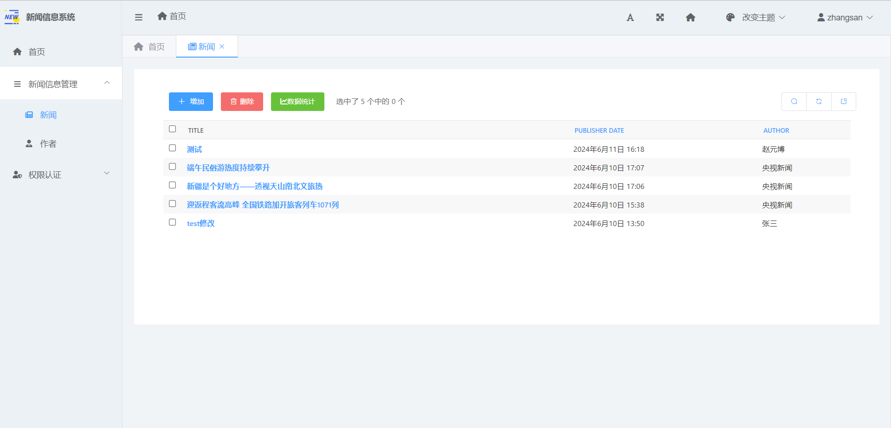
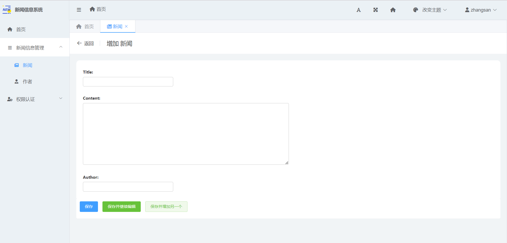
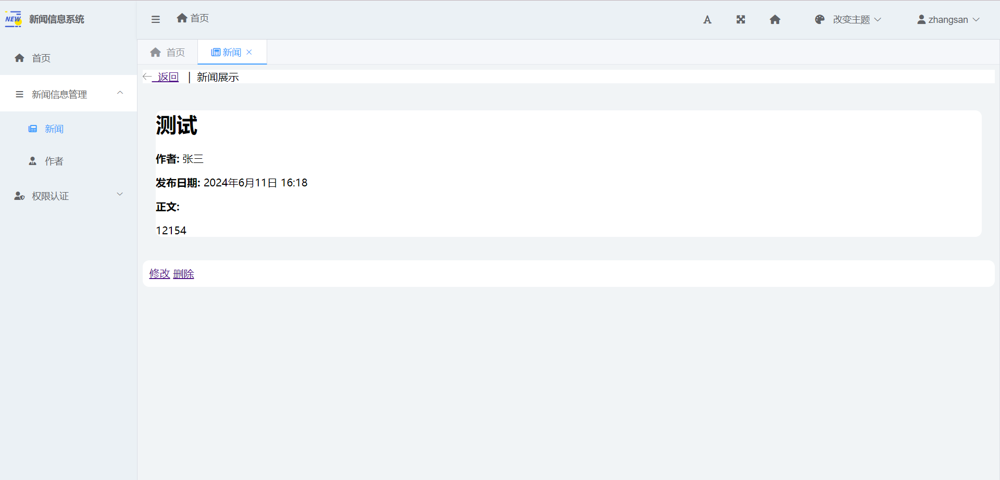
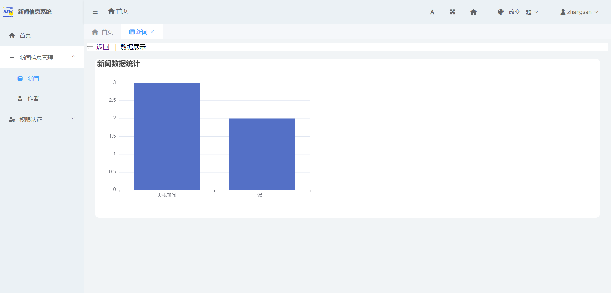

# News information system

## 项目简介
News Information System 是一个用于管理和展示新闻信息的系统，提供了新闻的发布、编辑、删除和展示功能。

## 技术栈
- **前端**:
  - HTML
  - CSS
  - JavaScript
  - BootStrap

- **后端**:
  - Django
  - SimpleUI

- **数据库**:
  - MySQL

## 项目截图

